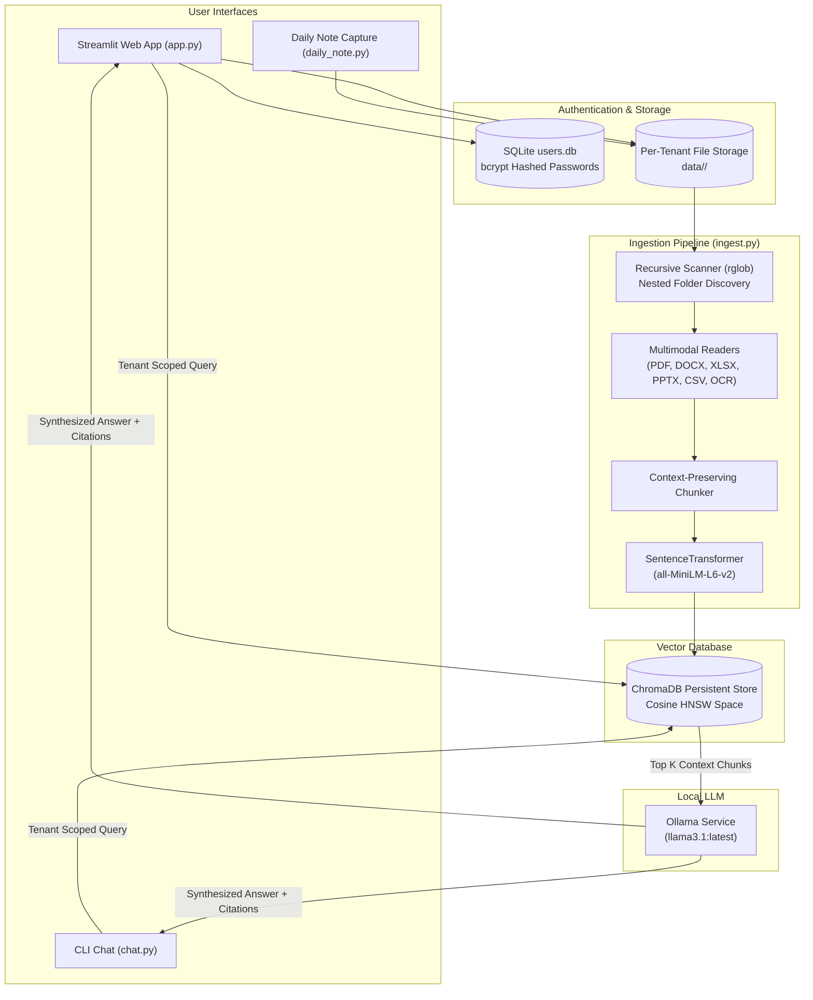

# 🧠 AI Memory OS — Enterprise Edition

[](https://www.python.org/)
[](https://streamlit.io/)
[](https://www.trychroma.com/)
[](https://ollama.ai/)
[]()

> **Enterprise-grade, fully local, multi-tenant RAG (Retrieval-Augmented Generation) system** featuring SQLite authentication, strict tenant data isolation, recursive nested folder ingestion, structured spreadsheet chunking, multimodal document processing, and local LLM inference via Ollama.

---

## 🌟 Key Features

- **🔐 Multi-Tenant Security & Isolation**: 
  - SQLite database with WAL mode and `bcrypt` password hashing.
  - Pre-seeded with 1,000 isolated tenant accounts (`user1` / `password1` to `user1000` / `password1000`).
  - Strict tenant metadata filtering (`where={"tenant_id": username}`) at the ChromaDB HNSW layer preventing cross-tenant data leakage.

- **📁 Deep Nested Folder Traversal & Ingestion**:
  - Traverses arbitrary subfolder trees (`parent/subfolder_1/subfolder_2/.../file.ext`) recursively using `rglob`.
  - Memory-safe streaming pipeline: processes files in configurable batches (`FILE_BATCH_SIZE=50`, `EMBED_BATCH_SIZE=64`, `UPSERT_BATCH_SIZE=500`) with explicit garbage collection between batches.

- **📊 Structured Spreadsheet RAG**:
  - Custom extraction for `.xlsx`, `.xls`, and `.csv` files.
  - Generates row-grouped chunks with sheet headers included in every chunk to preserve tabular context during vector search.

- **📄 Multimodal & Multi-Format Parsing**:
  - Text & Docs: `.pdf` (`pypdf`), `.docx` (`python-docx`), `.pptx` (`python-pptx`), `.txt`, `.md`, `.json`, `.xml`, `.rtf`, `.log`.
  - Web Pages: `.html`, `.htm` (script/style tag stripper).
  - Images: `.png`, `.jpg`, `.jpeg`, `.bmp`, `.gif`, `.tiff`, `.webp` with OCR powered by `pytesseract` and `Pillow`.

- **🤖 100% Offline & Local Execution**:
  - Local embeddings via `sentence-transformers/all-MiniLM-L6-v2`.
  - Local LLM inference powered by Ollama (`llama3.1:latest`). Zero cloud dependencies or external API keys required.

- **💻 Flexible GUI & CLI Interfaces**:
  - **Streamlit Web UI**: Multi-page web dashboard with user login, folder/file ingestion, semantic search with source relevance scoring, daily journal capture, and user stats/vault management.
  - **Terminal CLI Tools**: Interactive terminal chat (`chat.py`), quick daily note capture (`daily_note.py`), and batch file ingester (`ingest.py`).

---

## 🏗️ System Architecture



---

## 📁 Repository Structure

```
local-RAG/
├── app.py                  # Main Streamlit application entrypoint & navigation
├── auth.py                 # SQLite user auth module, bcrypt hashing & user seeding
├── chat.py                 # CLI terminal interactive RAG chat interface
├── daily_note.py           # CLI quick journal entry capture & auto-ingestion
├── ingest.py               # Enterprise ingestion pipeline (rglob, batching, multi-format)
├── app_pages/              # Streamlit multi-page dashboard views
│   ├── login.py            # User authentication page
│   ├── search.py           # Semantic memory search & RAG query interface
│   ├── ingest_page.py      # Folder/file batch upload & nested ingestion view
│   ├── journal.py          # Daily note quick capture & auto-index page
│   ├── stats.py            # Vault statistics & per-file deletion manager
│   └── settings.py         # Account info & password update view
├── tests/
│   └── test_all_features.py# Comprehensive automated test suite
├── requirements.txt        # Python dependency manifest
└── data/                   # Default root directory for tenant vaults
```

---

## 🚀 Quick Start

### 1. Prerequisites

- **Python**: Version `3.10` or higher installed.
- **Ollama**: Download and install [Ollama](https://ollama.ai/). Pull the default model:
  ```bash
  ollama pull llama3.1
  ```
- **Tesseract OCR (Optional)**: Required if you want OCR text extraction from images.
  - Linux (Ubuntu/Debian): `sudo apt-get install tesseract-ocr`
  - macOS: `brew install tesseract`

### 2. Environment Setup

Clone the repository and set up a virtual environment:

```bash
# Clone repository
git clone https://github.com/your-username/local-RAG.git
cd local-RAG

# Create virtual environment
python3 -m venv .venv
source .venv/bin/activate

# Install dependencies
pip install -r requirements.txt
```

### 3. Launching the Web Application

Start the Streamlit application:

```bash
streamlit run app.py
```

Open your browser at `http://localhost:8501`. 

> **Default Demo Login Credentials**:
> - **Username**: `user1` (up to `user1000`)
> - **Password**: `password1` (corresponding to user number)

---

## 💻 CLI Usage

In addition to the Web GUI, AI Memory OS provides command-line interfaces for headless environments:

### Terminal Interactive Q&A (`chat.py`)
Ask questions directly from your terminal with tenant isolation:
```bash
python chat.py
```

### Daily Quick Capture (`daily_note.py`)
Append daily journal entries and automatically index them into your memory vault:
```bash
python daily_note.py
```

### Batch Ingestion (`ingest.py`)
Trigger ingestion over any directory containing supported documents:
```bash
python ingest.py
```

---

## 🧪 Testing & Verification

The codebase includes an automated test suite verifying core capabilities:
- User authentication & `bcrypt` hashing
- Structured spreadsheet parsing (`.csv`, `.xlsx`, `.xls`)
- Deeply nested folder discovery (`rglob`)
- Tenant isolation in ChromaDB (detects and prevents cross-tenant data leakage)

Run the test suite with:

```bash
python -m unittest discover -s tests
```

---

## 🛡️ Security & Privacy

- **Data Isolation**: All ChromaDB queries filter explicitly by `tenant_id`. Users can only search, view, or delete their own indexed files.
- **Password Security**: Passwords are never stored in plain text. They are hashed using `bcrypt` with salt generation.
- **Offline Guarantee**: Data never leaves your machine. Embeddings and LLM responses are calculated locally via `sentence-transformers` and `Ollama`.

---

## 📜 License

Distributed under the MIT License. See `LICENSE` for more information.
